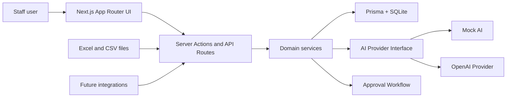

# Architecture

## Architecture Goals

- Build a local-first MVP that runs with SQLite and mock AI.
- Keep the core domain independent from external booking providers.
- Keep AI behind a provider abstraction so mock and OpenAI modes share the same app flow.
- Store venue rules in structured data and pass them into AI as context.
- Preserve human approval for guest-facing and operationally sensitive output.
- Keep the Prisma schema compatible with a later Supabase/Postgres migration.

## System Overview



## Planned Folder Structure

```txt
app/
  layout.tsx
  page.tsx
  (app)/
    layout.tsx
    dashboard/page.tsx
    imports/page.tsx
    bookings/page.tsx
    bookings/[bookingId]/page.tsx
    analytics/page.tsx
    forecast/page.tsx
    briefing/page.tsx
    inquiries/page.tsx
    inquiries/[inquiryId]/page.tsx
    approvals/page.tsx
    settings/page.tsx
  api/
    imports/route.ts
    ai/briefing/route.ts
    ai/inquiry-reply/route.ts
    approvals/[approvalTaskId]/route.ts
    forecast/route.ts

components/
  ui/
  app/
    app-shell.tsx
    navigation.tsx
    page-header.tsx
  charts/
  forms/
  approvals/
  imports/
  inquiries/

lib/
  ai/
    index.ts
    types.ts
    mock-provider.ts
    openai-provider.ts
    prompts/
      manager-briefing.ts
      inquiry-reply.ts
  analytics/
    metrics.ts
    booking-series.ts
    guest-insights.ts
  auth/
    roles.ts
  db/
    prisma.ts
  forecast/
    forecast-service.ts
    confidence.ts
  imports/
    parse-workbook.ts
    column-detection.ts
    mapping.ts
    validation.ts
    normalize-booking.ts
  rules/
    venue-context.ts
    rule-checks.ts
  validation/
    env.ts
    schemas.ts

prisma/
  schema.prisma
  seed.ts

tests/
  unit/
  integration/
  e2e/
```

## Application Layers

### UI Layer

Use Next.js App Router pages and server components by default. Use client components only for interactive pieces such as uploads, charts, filters, editable drafts, and approval controls.

UI conventions:
- Use Tailwind CSS.
- Use shadcn/ui where it provides value.
- Keep domain-specific components in `components/app`, `components/imports`, `components/inquiries`, and `components/approvals`.
- Label AI output clearly as draft, suggestion, or generated summary.

### Domain Layer

Domain logic should live in `lib`, not inside route handlers. Important services:

- `lib/imports`: parse, validate, map, and normalize uploaded files.
- `lib/analytics`: deterministic metrics from booking data.
- `lib/forecast`: demand forecasting and confidence scoring.
- `lib/rules`: venue rules and AI-safe context assembly.
- `lib/ai`: provider abstraction and prompt orchestration.

### Data Layer

Use Prisma for all database access. Start with SQLite:

```env
DATABASE_URL="file:./dev.db"
```

Design schema fields and relations so migration to Postgres/Supabase is straightforward:
- Prefer explicit IDs.
- Store timestamps consistently.
- Avoid SQLite-only query assumptions.
- Use JSON fields carefully and only for raw imported rows, provider metadata, or structured AI context snapshots.

## Prisma Model Draft

The first schema should include these models:

- `Venue`
- `User`
- `OpeningHour`
- `VenueRule`
- `VenuePackage`
- `VenueArea`
- `Guest`
- `Booking`
- `BookingGuest`
- `ImportBatch`
- `ImportRow`
- `Inquiry`
- `DraftReply`
- `ApprovalTask`
- `AnalyticsSnapshot`
- `ForecastSnapshot`
- `AIInteractionLog`

Recommended enum groups:

- `UserRole`: `owner`, `manager`, `staff`, `viewer`.
- `BookingStatus`: `inquiry`, `confirmed`, `cancelled`, `completed`, `no_show`, `unknown`.
- `ApprovalStatus`: `pending`, `approved`, `rejected`, `needs_revision`, `expired`.
- `ApprovalTaskType`: `inquiry_reply`, `booking_summary`, `manager_briefing`, `staffing_recommendation`, `promotion_recommendation`, `rule_warning`.
- `AIMode`: `mock`, `openai`.

## AI Provider Abstraction

All AI calls should go through a provider interface. Route handlers and UI components must not import the OpenAI SDK directly.

```ts
export type AIProviderMode = "mock" | "openai";

export interface ManagerBriefingInput {
  venueId: string;
  dateRange: { start: string; end: string };
  metrics: unknown;
  forecast: unknown;
  venueRules: unknown;
  pendingApprovals: unknown[];
}

export interface InquiryReplyInput {
  venueId: string;
  inquiryText: string;
  extractedFields: Record<string, unknown>;
  venueRules: unknown;
  availabilityContext?: unknown;
}

export interface AIProvider {
  mode: AIProviderMode;
  createManagerBriefing(input: ManagerBriefingInput): Promise<ManagerBriefingResult>;
  draftInquiryReply(input: InquiryReplyInput): Promise<InquiryReplyResult>;
}
```

Provider behavior:
- `mock-provider.ts` returns deterministic output for tests and local demos.
- `openai-provider.ts` handles OpenAI API calls.
- `index.ts` selects provider based on environment.
- All calls create an `AIInteractionLog`.
- All guest-facing output creates an `ApprovalTask`.

## Import Pipeline

1. Receive file upload.
2. Parse workbook or CSV.
3. Detect columns.
4. Present mapping for human confirmation.
5. Validate each row.
6. Normalize rows into domain records.
7. Create or update guests.
8. Create bookings with source metadata.
9. Store raw rows and validation results.
10. Show import summary.

Import services should be testable without React or Next.js.

## Forecasting Pipeline

1. Load historical bookings for the requested window.
2. Aggregate by weekday, time block, package, status, and party size.
3. Load future confirmed bookings.
4. Apply opening hours and closed days.
5. Produce forecast values and confidence labels.
6. Store `ForecastSnapshot`.
7. Optionally pass results to AI for explanation and recommendations.
8. Create approval tasks for staffing or promotion recommendations.

Forecasting should work without AI. AI can summarize and explain, but numeric calculations should come from deterministic services.

## Approval Workflow

Approval tasks are the safety boundary for the MVP.

Rules:
- AI-generated guest replies require approval.
- Manager briefings are drafts until reviewed.
- Staffing and promotion recommendations are suggestions until approved.
- Approved output should store the exact approved text.
- Rejected or revised output should remain auditable.

Recommended fields:
- `taskType`
- `status`
- `sourceType`
- `sourceId`
- `draftContent`
- `approvedContent`
- `reviewerId`
- `reviewedAt`
- `createdByAIInteractionLogId`
- `metadata`

## Route and API Responsibilities

Pages:
- `/dashboard`: read-only operational overview.
- `/imports`: upload, mapping, validation, import history.
- `/bookings`: booking list and filters.
- `/analytics`: metric exploration.
- `/forecast`: future demand view.
- `/briefing`: manager briefing drafts and history.
- `/inquiries`: inquiry intake and copilot drafts.
- `/approvals`: review queue.
- `/settings`: venue rules and packages.

API routes or server actions:
- `POST /api/imports`: upload and parse.
- `POST /api/forecast`: create forecast snapshot.
- `POST /api/ai/briefing`: generate briefing draft.
- `POST /api/ai/inquiry-reply`: generate reply draft.
- `PATCH /api/approvals/:id`: approve, reject, or request revision.

## Testing Strategy

Minimum test coverage:
- Unit tests for analytics calculations.
- Unit tests for import parsing and normalization.
- Unit tests for forecast confidence labels.
- Unit tests for venue rule checks.
- Mock AI snapshot tests.
- Integration tests for approval workflow persistence.

Run after meaningful code changes:

```bash
npm run lint
npm run typecheck
npm test
```

If a command does not exist yet, add it when appropriate or report that it is not available.

## Future Integration Architecture

Keep integrations outside core booking logic:

```txt
lib/integrations/
  booking-systems/
  email/
  sms/
  instagram/
  website-widget/
```

Integration principles:
- Normalize external data into internal `Booking`, `Guest`, and `Inquiry` records.
- Store external IDs and provider metadata.
- Keep sending guest messages behind approval.
- Use webhooks where available.
- Use scheduled sync for providers without webhooks.
- Make provider failures visible without breaking core analytics.

Future integration targets:
- Booking systems for availability, bookings, cancellations, and source IDs.
- Email for inbound inquiries and approved outbound replies.
- SMS for approved reminders and follow-ups.
- Instagram for DM intake and approved reply drafts.
- Website widgets for embedded inquiry and availability request flows.
